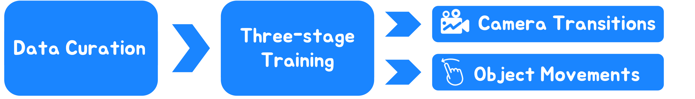

# Anonymous Image Conductor
This repository is the anonymous implementation of Image Conductor. It is a novel approach for precise and fine-grained control of camera transitions and object movements in interactive video synthesis.
<details><summary>Click for the full abstract of Image Conductor</summary>

> Filmmaking and animation production often require sophisticated techniques for coordinating camera transitions and object movements, typically involving labor-intensive real-world capturing. Despite advancements in generative AI for video creation, achieving precise control over motion for interactive video asset generation remains challenging. To this end, we propose Image Conductor, a method for precise control of camera transitions and object movements to generate video assets from a single image. An well-cultivated training strategy is proposed to separate distinct camera and object motion by camera LoRA weights and object LoRA weights. To further eliminate motion ambiguity from ill-posed trajectories, we introduce a camera-free guidance technique during inference process, enhancing object movements while eliminating camera transitions. Additionally, we develop a trajectory-oriented video motion data curation pipeline for training. Quantitative and qualitative experiments demonstrate our method's precision and fine-grained control in generating motion-controllable videos from images, advancing the practical application of interactive video synthesis.
</details>

**[Image Conductor: Precision Control for Interactive Video Synthesis]** 


[](https://anonymous-aaai-6452.github.io/project/ImageConductor/)


<!--  -->


**📖 Table of Contents**


- [Anonymous Image Conductor](#anonymous-image-conductor)
  - [🎨 Gallery](#-gallery)
  - [🧙 Method Overview](#-method-overview)
  - [🔧 Preparations](#-preparations)
    - [Setup repository and conda environment](#setup-repository-and-conda-environment)
    - [Prepare model weights](#prepare-model-weights)
  - [💫 Inference](#-inference)
    - [Run scripts](#run-scripts)
    - [Run local gradio demo](#run-local-gradio-demo)
    - [Camera Change](#camera-change)
    - [Object Movements](#object-movements)
  - [📣 Disclaimer](#-disclaimer)


## 🎨 Gallery
We show more results in the [Anonymous Project Page](https://anonymous-aaai-6452.github.io/project/ImageConductor/).

## 🧙 Method Overview
<div align="center">
    
</div>
To address the lack of large-scale annotated video data, we first design a data construction pipeline to create a consistent video dataset with appropriate motion. Then, an well-cultivated two-stage training scheme is proposed to derive motion-controllable video ControlNet, which can separate camera tansitions and object movements based on distinct lora weights.


## 🔧 Preparations
### Setup repository and conda environment
Adjust the PyTorch version according to the CUDA version you are using. CUDA 12.1 for our case.
```
git clone https://github.com/anonymous-aaai-6452/anonymous-6452.git
cd ImageConductor

conda create -n imageconductor python=3.10 -y
conda activate imageconductor
pip install -r requirements.txt
```
### Prepare model weights
- Download the weights of Stable-Diffusion v1.5 [SDv1.5](https://huggingface.co/runwayml/stable-diffusion-v1-5) and put it to `./models`.
- Download the weights of ImageConductor [imageconductor_v1]() and put it to `./models`.
- (optional) Manually download the community .safetensors models from [CivitAI](https://civitai.com), and save them to models/personalized.
The model structure should be like:
```
|-- models
    |-- stable-diffusion-v1-5
        |-- model_index.json
        |-- vae
        |-- text_encoder
        |-- ...
    |-- unet.ckpt
    |-- image_controlnet.ckpt
    |-- flow_controlnet.ckpt
    |-- personalized
        |-- helloobjects_V12c.safetensors
        |-- TUSUN.safetensors
        |-- ...
```


## 💫 Inference
### Run scripts
- Running scripts:

        sh scripts/inference.sh
### Run local gradio demo
- Running scripts:
  
        sh scripts/app.sh


### Camera Change
<table class="center">
<tr>
  <td><video src="https://github.com/user-attachments/assets/de7065d4-8b4e-48c1-8ab7-b0cbb9d71ff5" autoplay></td>
  <td><video src="https://github.com/user-attachments/assets/b63954f0-fb43-4b2a-a413-0e25fbf8c28e" autoplay></td>
  <td><video src="https://github.com/user-attachments/assets/b8c03892-0cd4-421a-b951-3ecb30b9bb5f" autoplay></td>
</tr>
</table>

### Object Movements
<table class="center">
<tr>
  <td><video src="https://github.com/user-attachments/assets/38a4b6c4-852a-459f-a90e-1184c6b1948b" autoplay></td>
  <td><video src="https://github.com/user-attachments/assets/10076616-c35c-48a1-8397-de6836b76153" autoplay></td>
  <td><video src="https://github.com/user-attachments/assets/2b0cbfdd-a5e4-4933-b7ce-8c8defffca1e" autoplay></td>
</tr>
</table>

## 📣 Disclaimer
This is anonymous code of Image Conductor.
